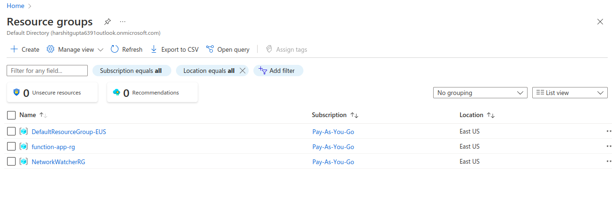
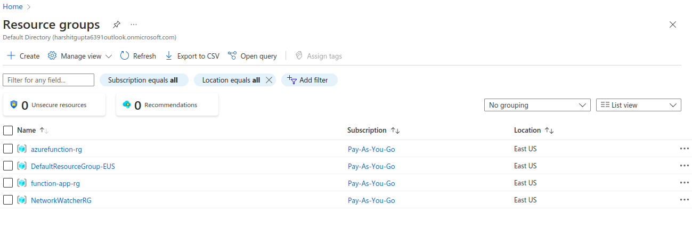
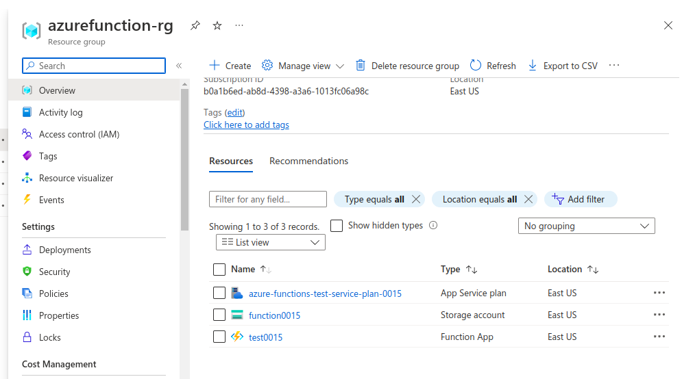

## Description
Here, In this template we get to know about how to create FunctionApp for Azure Functions.

---

### Steps:-
1. Login into the AZ account using the `az login`.
2. Run the file using the following commands:

`terraform init`

`terraform plan`

`terraform apply -auto-approve`

---
### Outputs

Before applying the terraform code , no resource group with the name **azurefunction-rg**.

After applying the terraform code:

Inside the resource group we have:

* App service plan
* Storage account
* Function App

---